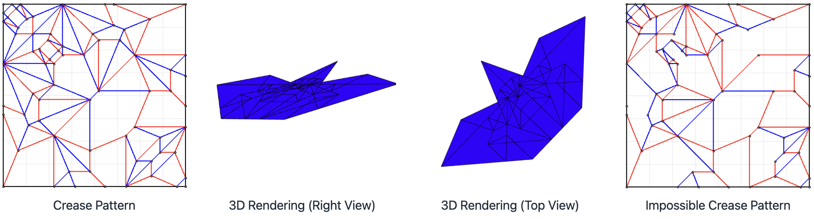
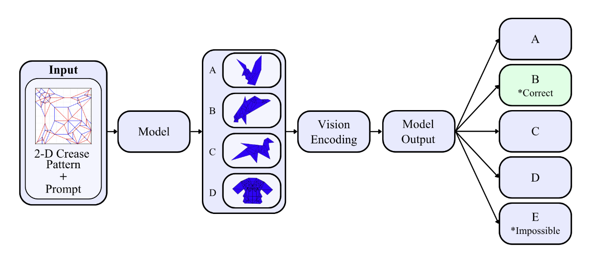

# GamiBench

End-to-end evaluation pipeline for benchmark MLLMs on 2D-to-3D Origami spatial mapping and reasoning tasks *(FrontierIR, NeusymBridge, & LMReasoning Bridge @ AAAI 2026, Springer Nature 2026)*.

> Paper: [arXiv:2512.22207](https://arxiv.org/abs/2512.22207) | Dataset: [Hugging Face](https://huggingface.co/datasets/stvngo/GamiBench)



**GamiBench** includes **186** valid and **186** impossible crease-pattern examples. Each crease pattern uses mountain/valley fold assignments and is paired with corresponding 3D folded outcomes across 6 viewpoints (top, bottom, front, back, right, left).



The evaluation framework is config-driven and reproducible, supporting single-model and multi-model runs, automatic and deterministic triple-task task generation with seeds, checkpoint/resume, and structured result logging for end-to-end benchmarking.

## Releases

- [v0.1.0 - Initial Public Release](RELEASE_v0.1.0.md)

## Structure

```
.
├── configs/             # Configuration files (YAML/JSON)
│   ├── base.yaml        # Base configuration template
│   ├── experiments/     # Experiment-specific configs
│   ├── models/          # Model configurations
│   └── datasets/        # Dataset configurations
├── data/                # Dataset folders (creases + fold viewpoints)
│   └── GamiBench/
├── models/              # Model definitions, wrappers
│   ├── base.py          # BaseModel interface
│   └── model_factory.py # Model factory
├── evaluators/          # Evaluation logic
│   └── base.py          # BaseEvaluator interface
├── baselines/           # Baseline implementations
├── experiments/         # Experiment scripts
├── utils/               # Shared utilities
│   ├── config_loader.py
│   ├── logger.py
│   ├── seeding.py
│   ├── data_loader.py
│   └── result_saver.py
├── outputs/             # Results, logs, checkpoints
│   ├── results/
│   ├── logs/
│   └── checkpoints/
├── scripts/             # One-off scripts, analysis
├── pipeline.py          # Main pipeline orchestration
└── run.py               # Main entry point
```

## 🚀 Quick Start

### Installation

```bash
# Create virtual environment
python -m venv venv
source venv/bin/activate  # On Windows: venv\Scripts\activate

# Install dependencies
pip install -r requirements.txt
```

### Basic Usage

#### Option 1: Config-Driven (Recommended)

```bash
# Run with a config file
python run.py configs/experiments/example.yaml

# With overrides
python run.py configs/experiments/example.yaml \
    --override model.name=gpt-4 \
    --override evaluator.batch_size=10
```

#### Option 2: CLI-Driven

```bash
python run.py \
    --benchmark ... \
    --model gpt-4 \
    --model-config configs/models/openai.yaml
```

### GamiBench End-to-End Scripts

The notebook evaluation flow is available as reproducible script runners:

```bash
# Single model (standard + alternative-view + impossible tasks)
python run.py configs/experiments/gamibench_single.yaml

# Multi-model suite (closed + open model groups, deterministic task plan)
python scripts/run_gamibench_suite.py --config configs/experiments/gamibench_suite.yaml --group all

# Closed-only or open-only
python scripts/run_gamibench_suite.py --group closed
python scripts/run_gamibench_suite.py --group open

# Run only selected models by id
python scripts/run_gamibench_suite.py --models openai_gpt4o_mini claude_4_5_sonnet

# Resume unfinished model checkpoints
python scripts/run_gamibench_suite.py --resume
```

Set provider keys before running:

```bash
export OPENAI_API_KEY=...
export ANTHROPIC_API_KEY=...
export GEMINI_API_KEY=...
export XAI_API_KEY=...
export OPENROUTER_API_KEY=...
```

## Publish to Hugging Face

You can publish and sync the dataset with the built-in scripts.

```bash
# 1) Authenticate once
hf auth login

# 2) Publish dataset to a HF dataset repo
python scripts/publish_hf_dataset.py \
  --repo-id YOUR_USERNAME/GamiBench \
  --private

# Optional dry-run preview
python scripts/publish_hf_dataset.py \
  --repo-id YOUR_USERNAME/GamiBench \
  --dry-run
```

This uploads:
- `data/GamiBench` (dataset files)
- `configs/experiments/gamibench_single.yaml` and `gamibench_suite.yaml`
- `hf/README_dataset.md` as the dataset card (`README.md` in HF repo)

To download/sync the dataset locally:

```bash
python scripts/download_hf_dataset.py \
  --repo-id YOUR_USERNAME/GamiBench \
  --local-dir data
```

## Configuration

Configuration files use YAML format and support:
- Hierarchical configs (base + experiment-specific)
- Environment variables (`${VAR_NAME}`)
- Command-line overrides

### Example Config

```yaml
experiment_name: "my_experiment"
seed: 42

model:
  type: "openai"
  name: "gpt-4"
  api_key: "${OPENAI_API_KEY}"
  temperature: 0.7

dataset:
  path: "data/my_dataset.json"
  format: "json"

evaluator:
  type: "my_benchmark"
  batch_size: 10

output_dir: "outputs/results"
```

## Extending the Pipeline

### Adding a New Model

1. Create model class inheriting from `BaseModel`:

```python
# models/my_model.py
from .base import BaseModel

class MyModel(BaseModel):
    def generate(self, prompt, **kwargs):
        # Implementation
        pass
    
    def score(self, prompt, completion, **kwargs):
        # Implementation
        pass
```

2. Register in factory:

```python
# models/__init__.py
from .my_model import MyModel
ModelFactory.register("my_model", MyModel)
```

### Adding a New Evaluator

1. Create evaluator class inheriting from `BaseEvaluator`:

```python
# evaluators/my_benchmark.py
from .base import BaseEvaluator

class MyBenchmarkEvaluator(BaseEvaluator):
    def evaluate(self):
        results = self.evaluate_batch(self.data)
        metrics = self.compute_metrics(results)
        return {
            'results': results,
            'metrics': metrics
        }
    
    def evaluate_single(self, example):
        # Implementation
        pass
```

## Results

Results are saved in `outputs/results/` with:
- `results.json`: Full evaluation results
- `metrics.json`: Aggregated metrics
- `config.yaml`: Frozen configuration
- `metadata.json`: Experiment metadata

## Documentation

- See `configs/base.yaml` for configuration options
- See `models/base.py` for model interface
- See `evaluators/base.py` for evaluator interface

## Contributing

1. Follow the modular structure
2. Add docstrings to all functions
3. Write tests for new components
4. Update documentation

## Citation
Please cite our work for future usage!

```bibtex
@misc{spencer2025gamibenchevaluatingspatialreasoning,
      title={GamiBench: Evaluating Spatial Reasoning and 2D-to-3D Planning Capabilities of MLLMs with Origami Folding Tasks},
      author={Ryan Spencer and Roey Yaari and Ritvik Vemavarapu and Joyce Yang and Steven Ngo and Utkarsh Sharma},
      year={2025},
      eprint={2512.22207},
      archivePrefix={arXiv},
      primaryClass={cs.AI},
      url={https://arxiv.org/abs/2512.22207},
}
```
